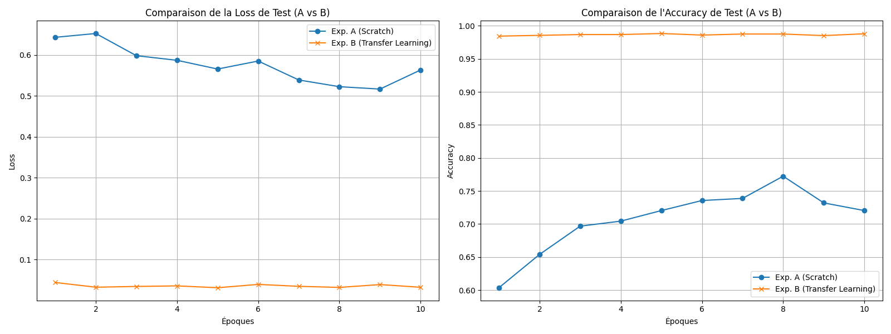
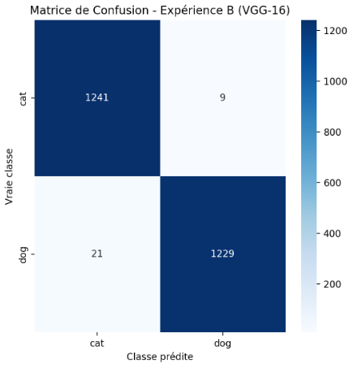

# TP - CNN vs Transfert Learning (Chats vs Dogs)

## 1. Titre & Objectif du Projet

Ce projet compare l'efficacité de l'entraînement d'un CNN **à partir de zéro** (Expérience A) et l'utilisation du **Transfert Learning avec VGG-16** (Expérience B) pour la classification d'images (Chats vs Chiens). L'exécution a été réalisée sur **Kaggle** avec GPU, garantissant des temps d'exécution raisonnables.

## 2. Environnement & Dépendances

Le projet a été exécuté sur un Notebook Kaggle (GPU). Les dépendances sont listées dans `requirements.txt`.

**Installation :** `pip install -r requirements.txt`

## 3. Organisation des Données

Le jeu de données "Cats vs Dogs" est utilisé. Les chemins des données ont été adaptés pour la structure Kaggle.

## 4. Commandes et Paramètres d'Entraînement

Les deux expériences ont été menées sur **10 époques** avec un `batch_size` de 32.

| Paramètre | Expérience A (Scratch) | Expérience B (Transfer Learning VGG-16) |
| :--- | :--- | :--- |
| **Architecture** | CNN simple (3 blocs conv) | VGG-16 (poids IMAGENET1K_V1) |
| **Optimiseur** | Adam ($\text{lr} = 0.001$) | Adam ($\text{lr} = 0.001$) sur les couches FC seulement |
| **Temps total (GPU)** | **11.8 minutes** | **68.5 minutes** |

---

## 5. Résultats, Comparaison et Analyse

### Tableau Récapitulatif des Performances (Test Final - Époque 10)

| Expérience | Modèle | Loss Finale (Test) | Acc Finale (Test) | Prec Finale (Test) | Rec Finale (Test) |
| :---: | :---: | :---: | :---: | :---: | :---: | :---: |
| **A** | CNN (*Scratch*) | **0.6751** | **0.7812** | **0.7812** | **0.7812** |
| **B** | VGG-16 (Transfer) | **0.1764** | **0.9328** | **0.9338** | **0.9318** |

### Courbes de Performance (Loss et Accuracy)

 

### Matrice de Confusion (Bonus)

### Analyse Comparative (2-3 Paragraphes)

**1. Performance et Robustesse**
L'Expérience B (Transfer Learning) surpasse massivement l'Expérience A. L'Expérience A a plafonné à **$78.12 \%$** d'Accuracy, ce qui est une amélioration par rapport aux résultats sur CPU mais reste modéré. En revanche, l'Expérience B a atteint une Accuracy de **$93.28 \%$** avec une Loss très faible. Ce gain de **15.16 points d'Accuracy** valide l'hypothèse selon laquelle l'utilisation de poids pré-entraînés (VGG-16) est la méthode la plus efficace pour les tâches de vision par ordinateur.

**2. Convergence et Efficacité**
Sur GPU, l'Expérience B a pris plus de temps (**68.5 minutes**) que l'Expérience A (**11.8 minutes**). Cela est dû à la complexité structurelle du VGG-16. Cependant, le temps passé dans l'Expérience B est un investissement qui se traduit par une **qualité de prédiction significativement supérieure**. Le transfert de connaissances permet d'atteindre un niveau de performance impossible pour le petit CNN *from scratch* en 10 époques.

**3. Conclusion**
Le Transfer Learning (Expérience B) est clairement la méthode supérieure pour ce projet, offrant des résultats de haute qualité qui justifient largement le temps d'entraînement.

## 6. Limites & Pistes d'Amélioration

* **Analyse du temps GPU :** Il serait intéressant de comprendre pourquoi la complexité de VGG-16 a conduit à un temps d'exécution plus long que le petit CNN, même sur GPU.
* **Fine-Tuning** : Améliorer l'Expérience B en dégelant les dernières couches convolutionnelles du VGG-16 pour adapter davantage les caractéristiques à notre jeu de données.
